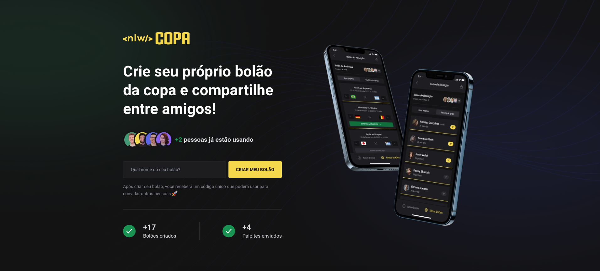

# NLW COPA 🇧🇷

### This project was developed during the NEXT LEVEL WEEK offered by Rocketseat 🚀

# Project 🖥️

Participate in betting on the world cup games ⚽

# Technologies 👩‍💻

- [React](https://pt-br.reactjs.org/)
- [React Native](https://reactnative.dev/)
- [TypeScript](https://www.typescriptlang.org/docs/)
- [Node](https://nodejs.org/en/docs/)
- [Prisma](https://www.prisma.io/)
- [Expo](https://expo.dev/)
- [Fastify](https://www.fastify.io/)
- [Tailwindcss](https://tailwindcss.com/)
- [Native Base](https://nativebase.io/)
- and others...

# Desktop

In the **WEB** directory you can run: (*if necessary remove de host: "0.0.0"*)

1. `npm i`
2. `npm run dev`

# Mobile

In the **MOBILE** directory you can run:

1. `npm i`
2. `npx expo start`

